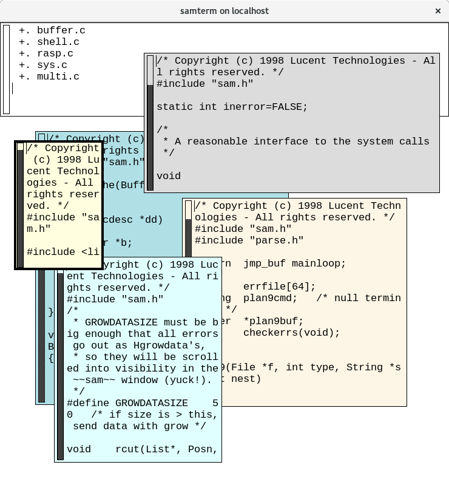

Introduction
============

sam is a text editor originally written for the Blit_ graphical terminal connected to a machine running `9th Edition Research Unix`_.
It contained many useful innovations, the most famous of which was its use of `structural regular expressions`_.

sam was the standard text editor for `Plan 9 from Bell Labs`_, and the Plan 9 version was backported to Unix and the X Window Sytem in the 1990s.

.. _Blit: https://en.wikipedia.org/wiki/Blit_(computer_terminal)

.. _`9th Edition Research Unix`: https://en.wikipedia.org/wiki/Research_Unix

.. _`structural regular expressions`: http://doc.cat-v.org/bell_labs/structural_regexps/se.pdf

.. _`Plan 9 from Bell Labs`: http://plan9.bell-labs.com/plan9/

This version of sam is based on that 1990s Unix port, with many useful additions and modifications (see `New Features`_).

*Note that this is not stable software.*
This version of sam is under heavy development;
the goal being to get it working before making it beautiful.
That being said, it's my primary editor, so any major bugs tend to get fixed pretty quickly.
Still, be careful with it.

The Obiligatory Screenshot
--------------------------

Community
=========

Rob posts updates about sam on Twitter at http://twitter.com/TheKingAdRob.

Installation
============

Basic Installation
-------------------
Installation and configuration is fairly simple:

- You need to be running X11 of some sort.
  On the Mac, `XQuartz`_ seems to work well.
  On Linux and BSD systems,
  the operating system's installation of X should be fine.
- If you need to modify the default compile-time configuration (which is unlikely)
  copy `config.mk.def` to `config.mk` and modify as needed
- Run `make clean`
- Run `make`
- Run `make install` or, if needed, `sudo make install`

Note that running `make install` will install a `desktop entry file`_, in either "system" or "user" mode.
This can be specified via the `MODE` make variable (the default is "user").
To isntall the desktop entry for the all users, use:

    make MODE=system install

The `sam` command runs sam.
The `B` command adds a new file to a running instance of sam,
or starts sam if it's not already running.
To configure sam,
create a `.samrc` file in your home directory.
The file `doc/samrc <doc/samrc>`_ file serves as a useful example of such a file.

.. _`XQuartz`: https://www.xquartz.org/
.. _`desktop entry file`: https://specifications.freedesktop.org/desktop-entry-spec/latest/

Running Remotely
--------------------

Both the `sam` and `B` commands accept an '-r' argument,
naming a remote machine or
(assuming you're using `ssh(1)`,
an SSH host entry).
The remote machine only needs to have the `sam` binary.

The remote machine may also have the `B` command installed
(as a symbolic/hard link to `sam`).
If it is installed,
the `B` command can be executed both locally (on the machine running `samterm`) using the '-r' option,
and remotely (on the machine running `sam`) without the '-r' option.
The `B` command requires a remote shell client that supports UNIX domain socket forwarding;
such support has been present in OpenSSH since at least version 6.7 (released in 2014).
See the `sam(1)` manual page for information on how the remote shell client is invoked.

Note that sam relies on the contents of the `LANG`, `LC_CTYPE`, and/or `LC_ALL` environment variables to determine the character encoding to use.
If you're using `ssh(1)` to run sam remotely, be sure to pass those variables along or have them set remotely.

Installation Paths
-------------------

By default, `sam`, `samterm`, and `B` all end up in '$(BINDIR)' as defined in config.mk.

Compatibility
-------------

Note that Deadpixi sam has extended the binary protocol spoken between sam and samterm.
That means that a Deadpixi samterm won't work with a non-Deadpixi sam,
nor will a Deadpixi sam work with a non-Deadpixi samterm.

New Features
============

Modern OS Support
    This version of sam compiles and runs on modern Linux/Unix/BSD/macOS systems under X11.

Improved 64-bit Support
    The original sam had support for 32-bit architectures and big-endian 64-bit architectures.
    This version supports 64-bit architectures of any endianess (including, most importantly, x86_64).

Scalable Font Support
    This version of sam is not limited to classic X fonts, but can use modern scalable fonts.
    Inconsolata_ is this author's favorite, though `Courier Prime Code`_ and `Go Mono`_ are giving Inconsolata a run for its money.

X Input Method and Composition Support
    This version of sam supports the X Input Method extension for input processing.
    This allows users to input text via the methods with which they are most comfortable.
    Additionally, the XCompose(5) file can be used to bind arbitrary sequences of keystrokes
    to different input character sequences.
    This mechanism is both more portable and more extensible than the old composed text
    input mechanism.

Multicolor Support
    This version of sam supports configurable text, selection, border, and background colors.
    It also allows different files to have different background colors,
    allowing different files to be easily distinguished.
    The default is still the classic two-color appearance, of course.
    These colors can be configured at runtime.
    (Note that this does *not* mean that sam has syntax highlighting.
    That will almost certainly never happen.)

Simplified and Dynamic Configuration
    The graphical elements (colors and fonts) of this version of sam are controlled via environment variables, not X Resources.
    Keybindings and mouse chords are configurable at runtime via a configuration file.

Far Better Keyboard Support
    The selection ("cursor") can be moved using keyboard commands.
    Additional keyboard-accessible commands allow jumping between file windows and the command window,
    scrolling the display, snarfing, pasting, etc.
    The binding of these commands to keyboard sequences is configurable at run-time (via the `~/.samrc` file).

Support for Two-Button Mice and Wheel Mice
    The original sam required a three-button mouse.
    This version is still easier to use with such a mouse, but can be used with a two-button mouse by simulating a button-3 press using shift-button-2.
    This version also supports scrolling with mouse wheels.

Support for Mouse Chords
    The commands available for keyboard binding are also accessible via mouse-button combinations ("chords").
    By default, the snarf, cut, and paste commands are mapped to chords.
    The binding of these chords is configurable at run-time.

Better Remote Editing Support
    This version of sam can use `ssh(1)` as its remote shell.
    Additionally, the B command works on both the local and the remote system during remote editing sessions.

Command Language Extensions
    Various minor and mostly-compatible changes have been made to the sam command language.
    Most notable is the `b` command, which now performs a fuzzy match on filenames, making switching between files much faster and easier.

Improved Manual Page
    The manual page has been rewritten to use the modern `mdoc(7)` manual page macros.
    It has been additionally cleaned up, clarified, and extended.

Support for Tab Expansion
    When enabled, tabs will be expanded into spaces.

Arbitrary Encoding Support
    This version of sam now uses the operating system's multibyte encoding functions.
    That means that it is not limited to UTF-8, but can edit files in any encoding supported by the operating system.
    This also means that on modern systems, files containing codepoints outside of the Basic Multilingual Plane can be edited
    (as opposed to classic sam, which supported only the BMP).

Numerous Bug Fixes
    This version of sam fixes some crashes and memory leaks that were in the original version.
    It feels nice fixing a thirty year old memory leak. ☺

Code Cleanup and Modernization
    This version of sam uses C99 standard integer types everywhere, and uses a much simpler buffer implementation.
    This makes the code more portable and easier to understand.

.. _Inconsolata: http://www.levien.com/type/myfonts/inconsolata.html

.. _`Courier Prime Code`: http://quoteunquoteapps.com/courierprime/

.. _`Go Mono`: https://blog.golang.org/go-fonts

.. _`WordStar Diamond`: http://texteditors.org/cgi-bin/wiki.pl?WordStarDiamond

The Future
==========

This project has an end goal:
once the issues listed here are complete,
this edition of sam will enter maintenance mode.

Primary Goals
-------------

- Scalable font support (DONE)
- Support big- and little-endian 64-bit systems (DONE)
- Support compilation and use on modern \*nix systems (DONE)
- Support two-button mice (DONE)
- Support tab expansion (DONE)
- Support runtime configuration of tab sizes (DONE)
- Support scroll wheels on mice (DONE)
- Support fuzzy matching in the `b` command (DONE)
- Raise the window when opening a new file (DONE)
- Support a configurable set of keybindings (i.e. rework the keyboard layer) (DONE)
- Support multiple background colors at once (DONE)
- Support the following commands for keybindings
    - escape (DONE)
    - scrollup / scrolldown (DONE)
    - charright / charleft (DONE)
    - lineup / linedown (DONE)
    - jump to/from command window (DONE)
    - delword / delbol / del / delbs (DONE)
    - snarf / cut / paste / exchange (DONE)
    - write (DONE)
    - nextlayer / prevlayer (TODO)
    - maximize / tile left / tile right (TODO, also looking into acme-like tiling)
    - look (DONE)
    - /regex (DONE)
    - send (DONE)
    - eol / bol (DONE)
- Support a configurable scroll factor;
  scrolling is a bit drastic now (DONE)
- Support Unicode beyond the Basic Multilingual Plane (TODO, possibly making sam agnostic about encoding)
- Support font fallback (TODO)
- Allow runtime configuration of key bindings (DONE)
- Support a configurable set of mouse chords (DONE)
- Support runtime configuration of mouse chords (DONE)
- Support mouse button reassignment (TODO)
- Support runtime mouse button reassignment (TODO)
- Remove external command FIFO, switch to UNIX domain sockets for IPC
  (email me if you want to know why I think this is a good idea) (DONE)
- Support the CDPATH environment variable for the `cd` command (TODO)
- Split the man page into documentation for `samterm`, `sam`, `keyboard`, and `samrc` (DONE)
- Add localization support (TODO)
- Add a Desktop Entry file, icon, etc (TODO)
- Create RPMs, DEBs, etc (TODO)
- Refactor all code to be as clean and standards-compliant as possible;
  remove all legacy code (TODO)
- Compile with no warnings,
  with all and extra warnings and `-pedantic` enabled on GCC in C99 mode (TODO)
- Run with no Valgrind-detected leaks or errors (DONE)

Stretch Goals
-------------
- Remove Xt dependency (TODO)
- Switch to a more X11-y model (e.g. one child window per layer) (TODO)
- Shell windows (TODO)

Very Unlikely Goals
-------------------
- Windows port (no, seriously, stop laughing)
- Non-X11 Mac OS X port
- Console port

Permissible Changes in Maintenance Mode
---------------------------------------
Once the above goals are met, the only changes that will be made to sam are:

- Bugfixes
- Translation updates
- Binary package updates
- Updates necessary to keep sam compiling on whatever systems its users are using

Things That Won't Ever Happen (Sorry)
-------------------------------------
- Syntax highlighting
- Multiple cursors
- Complex text rendering
  (I really am sorry about this one;
  I want speakers of languages with more complex writing systems to use sam,
  but getting it to work would be nigh impossible)

How You Can Help
================

- *Use sam!*
  Open up issues on GitHub if you see any problems or have any ideas.
- *Spread sam!*
  Tell your friends and colleagues.
  Anyone know Rob Pike, Brian Kernighan, Ken Thompson, or Bjarne Stroustrup?
  They are known sam-users, see if they like this version. :)
- *Package sam!*
  Create packages or ports of sam for your operating system of choice.
- *Document sam!*
  I'm not particularly good at readable,
  accessible documentation.
  If you are,
  I'd love help!
- *Translate sam!*
  Currently, sam only speaks English.
  I'd like to see sam speak all of the languages that its users speak.
- *Draw sam!*
  I can't draw.
  At all.
  Sam needs a decent icon for use with various desktops.
  If you can draw a nice scalable icon for sam,
  I would be very happy to see it.
- *Write sam!*
  Write code and send patches.

Credits
=======

These credits are in rough chronological order:

Rob Pike, Howard Trickey, Matty Farrow, Boyd Roberts, Doug Gwyn, James Clark, Mark H. Wilkinson, et al.
    Authors and/or contributors to the original X version of sam,
    upon which this version is based.

Rob King
    Added most of the things mentioned in `New Features`_ above.
    Rob is the author and maintainer of this version of sam.

Chris Siebenmann
    Many many many suggestions, fixes, and improvements.

Aram Havarneanu
    Improved the handling of Makefile variables.

Ishpeck
    Improved C89 support.

Tommy Pettersson
    Numerous bugfixes and suggestions.

Christian Neukirchen
    Found and fixed numerous bugs.

Benjamin Scher Purcell
    Added the Cbol and Ceol commands.

Mike Rosenberg
    Helped get sam running on Mac OS X.
    Extensive testing help.

RamKromberg
    Offered numerous suggestions.

Erez Schatz
    Extensive testing help and evangelism.

ckeen
    Added Alt modifier support.

David Tolpin
    Added support for optional automatic indentation.

Andrew Higham
    Added support for focus-follows-mouse, based on a couple of patches posted
    to the sam-fans mailing list in the ‘90s. 

If I've forgotten you in this list of credits, please accept my apologies and email me (Rob King) at jking@deadpixi.com to be added.

Copyright and License
=====================

The authors of this software are Rob Pike and Howard Trickey.
Copyright (c) 1998 by Lucent Technologies.

Rob King made some changes.
Those changes, Copyright (c) 2014-2016 by Rob King.

Permission to use, copy, modify, and distribute this software for any
purpose without fee is hereby granted, provided that this entire notice
is included in all copies of any software which is or includes a copy
or modification of this software and in all copies of the supporting
documentation for such software.

THIS SOFTWARE IS BEING PROVIDED "AS IS", WITHOUT ANY EXPRESS OR IMPLIED
WARRANTY.  IN PARTICULAR, NEITHER THE AUTHORS NOR LUCENT TECHNOLOGIES MAKE ANY
REPRESENTATION OR WARRANTY OF ANY KIND CONCERNING THE MERCHANTABILITY
OF THIS SOFTWARE OR ITS FITNESS FOR ANY PARTICULAR PURPOSE.
